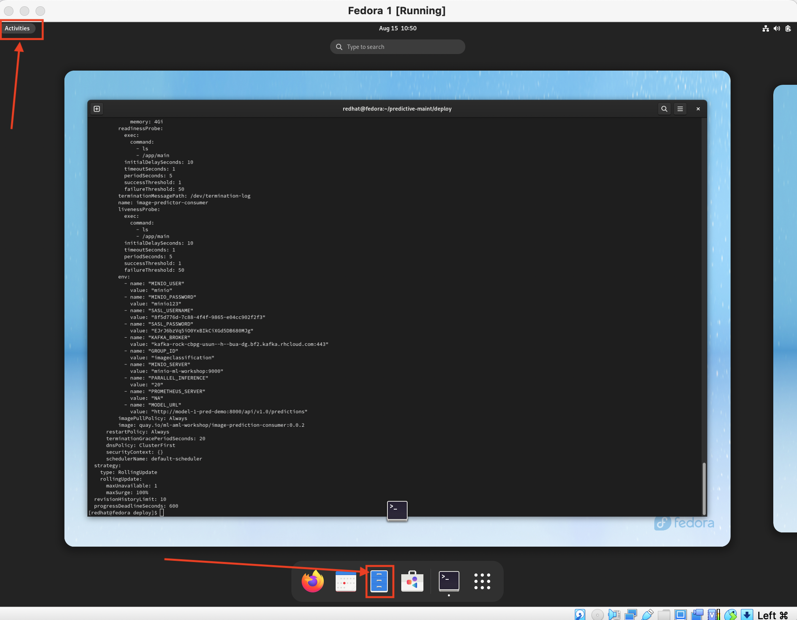
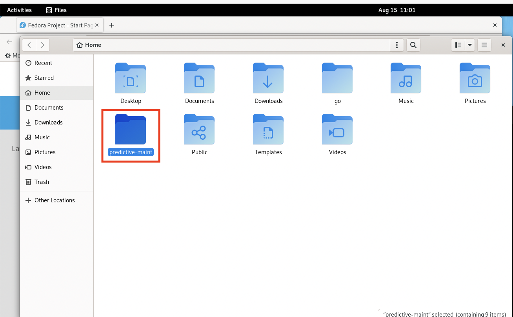
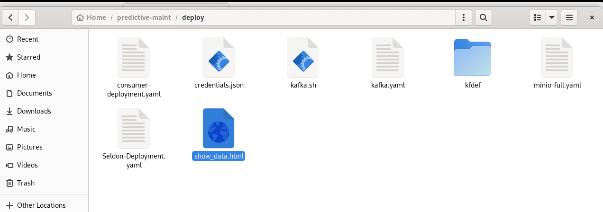
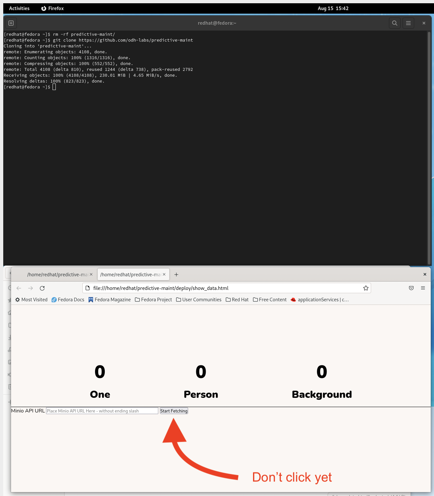
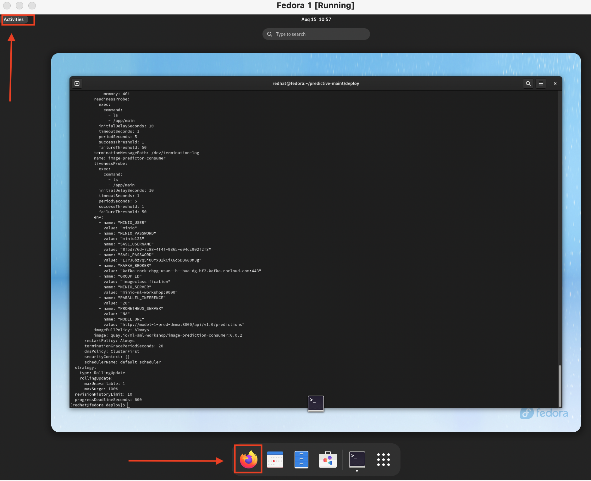

# Running the Inference Demo

Ensure you have setup this demo first, as instructed in [Setup Inference Demo](https://github.com/odh-labs/predictive-maint/blob/main/docs/image-detection-inference-demo-setup-v2.md)

## 1 - Open webpage on your VM that reports what the AI model sees

### Navigate to HTML file
Inside your VM, again click **Activities** then this time click the *files* button on the bottom


The files view will open. 



Click into **predictive-maint** then into **deploy**. Double click on ***show_data.html*** 


That HTML file will open in Firefox. 


You'll recall earlier, on OpenShift you retrieved your ***FULL_MINIO_API_ROUTE*** - the value beside ***1*** here:
 

Copy that ***FULL_MINIO_API_ROUTE*** value again.

Now open ***show_data.html*** again. If it's disappeared off screen hit ***Activities*** then click ***Firefox***


Paste your ***FULL_MINIO_API_ROUTE*** into the text box then click **Start Fetching**

## 2 - Run the OpenShift inference application to pull images from Kafka and make realtime predictions

Run this on ***another*** terminal on your laptop
```
oc apply -f $REPO_HOME/deploy/consumer-deployment.yaml
```

Switch to OpenShift and move to the pods view. In a couple of minutes, you should have a new pod Running and Ready for your inference application. 


This application is pulling images off the Kakfa streaming service and for each one it calls the ***Seldon exposed*** AI model - which predicts what it is seeing in that image.

The default model, writes a count of the following:
- the number of images it sees a person, i.e. you
- the number it sees soemthing else, we call those ***background***
Of course, the model can be trained to detect other objects, machinery damage, cancerous cells etc. More on that in the next section of the workshop.


## 3 - Run the Edge (VM based) Application to capture real-time images from your webcam

We're about to run an application inside the VM on your laptop that uses your webcam to pull images it sees and send them to Kafka. Go to the terminal inside your VM and run the following
```
cd $REPO_HOME/event-producer
go run .
```


This will immediately start pulling images from your webcam and sending them to Kafka. You'll see something like this on your terminal


Keep youself visible to the webcam for now

## 3 - Get ***show_data.html*** file to report on images


In a few seconds, you'll see the value of ***Person*** increasing. As soon as you do, put your hand in front of your webcam, so it can't see you. Within a few seconds, the object increasing should change from ***Person*** to ***Background***

This is awesome - it's detecting in realtime what your webcam sees!

When closing down your machine, save the machine state so you can revisit your work.

## Next workshop

Next we'll retrain our model so it can recognise objects other than a Person.

To that, move to [Set Up Model Training Demo](https://github.com/odh-labs/predictive-maint/blob/main/docs/image-detection-train-model-demo-setup.md)

